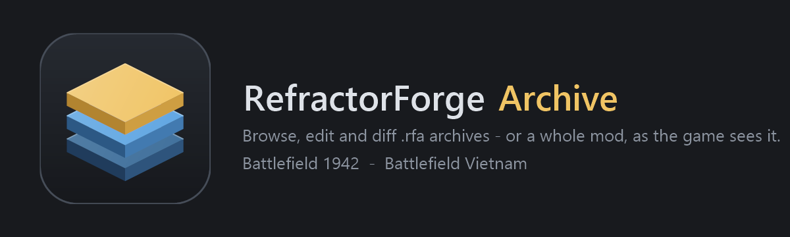

# RefractorForge Archive

A browser, editor and toolbox for Refractor Flat Archives (`.rfa`) — Battlefield 1942 and Battlefield Vietnam — and for whole mods. One self-contained program; nothing to install.

It is built on RefractorForge's RFA implementation, which round-trips retail archives byte-exactly and verifies every block it writes. Nothing touches an archive on disk until you save, and every save is checked before it reports success.

## Start

Run `RefractorForgeArchive.exe`. Open an `.rfa`, or drop one onto the window. Drop a **mod folder** (`Mods\<name>`, the one holding `init.con`) to open the whole mod.

## Open a mod, not one archive

A Refractor mod is a stack: its own archives, over the mods its `init.con` lists, over the base game, with numbered patches (`texture_001.rfa`, `Bocage_006.rfa`) over each. **Open Mod** merges the entire stack the way the engine does. Every row names the archive it came from; files that shadow a copy in a lower layer say so; untick a layer to see what lies beneath. *Open this file's own archive* jumps to the single archive that owns a file, for editing.

## Tools

| Tool | What it does |
|---|---|
| **Search** (Ctrl+F) | By file name (wildcards `*.con`, `tank*`) or by text inside files, across everything open. Double-click a result to jump. |
| **Find references** (Ctrl+R) | Every script and mesh that names the selected texture, sound or model — matched by base name, the way the engine resolves it. |
| **Unused assets** | Textures and sounds nothing references, largest first. Files the engine loads by convention (terrain tiles, menu art, lightmaps, sky) are never listed. Review before removing anything. |
| **Compare archives** (Ctrl+D) | A level against its patch, or two versions of a mod: only in A, only in B, changed by content, identical. |
| **Server-side copies** | Strip textures, sounds, movies and baked light from one archive or a whole folder of level archives. Dry run first. |
| **New mod** | The `Mods\<name>` folder, an `init.con` in the retail shape, and the archive folders. |
| **Clone object** | Duplicate a vehicle or weapon's `.con` set under a new name, every template renamed and every reference rewritten. Previewed before it is added. |

## Editing

Add, replace and delete files; everything is held until **Save**. Double-click a file to open it in its associated program — save there and the change comes straight back. Pictures (`.png`, `.jpg`, `.tga`, `.bmp`) added to an archive can be converted to DDS on the way in: snapped to power-of-two with a mipmap chain, because the engine silently drops any texture that is not.

Previews: DDS/TGA textures, WAV sounds, StandardMesh models (drag to orbit, wheel to zoom), terrain `.raw` heightmaps, and Refractor scripts with syntax colouring — double-click a template name to search for it.

## Notes

- Patch archives (`<Level>_NNN.rfa`) are not separate maps; the game layers them over the base. The mod view shows you exactly that.
- A whole base game (332 archives, 87,000 files) opens in well under a second; the unused-asset scan over all of it reads 30,000 scripts and meshes and takes a few seconds.
- Anything unexpected is written to `archive-crash.log` beside the program and shown, with the window left open so you can save.

Source: https://github.com/luccawulf/RefractorForge (`src/RefractorForge.Archive`). GPLv3.
